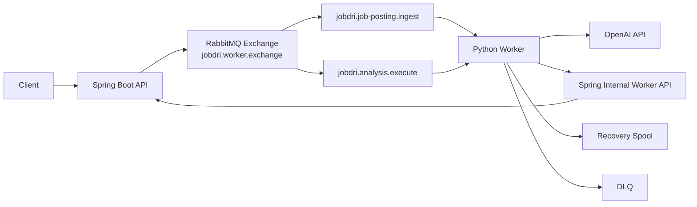

# JobDri Analysis Server

`JobDri`의 비동기 AI 작업을 처리하는 Python 워커 서버입니다.

이 레포는 Spring Boot 메인 서버와 RabbitMQ 사이에서 동작하며, 아래 두 종류의 작업을 비동기로 처리합니다.

- 채용 공고 정리(`JOB_POSTING_INGEST`)
- 자소서 분석(`ANALYSIS`)

작업을 큐에서 구독한 뒤 OpenAI 호출을 수행하고, 결과를 Spring 내부 API로 저장/완료 처리하는 것이 이 레포의 핵심 역할입니다.

## 1. 역할 요약

메인 백엔드(Spring)는 사용자 요청을 받은 뒤 직접 긴 AI 작업을 수행하지 않습니다. 대신 RabbitMQ에 작업 메시지를 적재하고, 이 워커가 메시지를 소비합니다.

워커는 다음 순서로 동작합니다.

1. RabbitMQ 큐를 구독합니다.
2. 메시지를 역직렬화해 작업 타입을 판별합니다.
3. Spring 내부 API에 작업 상태를 `RUNNING`으로 반영합니다.
4. OpenAI를 호출해 채용 공고 추출/분류/생성 또는 자소서 분석을 수행합니다.
5. 결과를 Spring 내부 API에 저장합니다.
6. 최종 완료 콜백을 전달합니다.
7. 실패 시 재시도, DLQ 적재, recovery spool 복구를 수행합니다.

## 2. 아키텍처



## 3. 큐 적재 / 구독 / 발행 방식

### 3.1 누가 큐에 적재하나요?

큐 적재는 이 레포가 아니라 메인 백엔드(Spring)에서 수행합니다.

- 채용 공고 작업
  `APP_WORKER_JOB_POSTING_EXCHANGE` + `APP_WORKER_JOB_POSTING_ROUTING_KEY`
- 자소서 분석 작업
  `APP_WORKER_ANALYSIS_EXCHANGE` + `APP_WORKER_ANALYSIS_ROUTING_KEY`

워커는 적재된 메시지를 소비하는 쪽입니다.

### 3.2 워커는 어떻게 구독하나요?

워커 시작 시 [`app/consumer.py`](/Users/shinae/Desktop/study/analysis-server/app/consumer.py) 의 `RabbitMqConsumer.start()`가 실행되고, 내부에서 다음 두 큐를 `basic_consume`으로 구독합니다.

- `APP_WORKER_JOB_POSTING_QUEUE`
- `APP_WORKER_ANALYSIS_QUEUE`

또한 `basic_qos(prefetch_count=WORKER_PREFETCH_COUNT)`를 사용해 한 번에 가져올 메시지 수를 제한합니다. 기본값은 `1`입니다.

### 3.3 워커가 발행하는 메시지도 있나요?

있습니다. 이 워커는 소비자이면서 일부 상황에서는 다시 RabbitMQ에 메시지를 발행합니다.

- 재시도 시
  원본 메시지의 `retryCount`를 증가시켜 같은 exchange/routing key로 재발행
- 최종 실패 시
  DLQ 큐로 발행

즉, 정상 처리 결과는 RabbitMQ로 다시 보내지 않고 Spring 내부 API로 전달하고, 큐 재발행은 재시도/실패 처리에만 사용합니다.

## 4. 작업 타입별 처리 흐름

### 4.1 채용 공고 정리 작업

`taskType=JOB_POSTING_INGEST`

1. Spring이 작업 메시지를 큐에 적재합니다.
2. 워커가 메시지를 소비합니다.
3. `/api/internal/worker/job-postings/tasks/{taskId}/running` 으로 상태를 `RUNNING` 처리합니다.
4. `/api/internal/worker/job-postings/ingest/context` 로 이미지 URL 등 컨텍스트를 조회합니다.
5. OpenAI로 공고 추출을 수행합니다.
6. `/api/internal/worker/job-postings/classification/candidates` 로 분류 후보를 조회합니다.
7. OpenAI로 후보 중 소분류를 선택합니다.
8. 신뢰도가 낮으면 저장 없이 `/complete` 로 종료합니다.
9. 신뢰도가 충분하면 OpenAI로 저장용 공고 내용을 생성합니다.
10. `/result` 로 중간 결과를 저장합니다.
11. `/ingest/finalize` 로 최종 저장/완료를 요청합니다.

### 4.2 자소서 분석 작업

`taskType=ANALYSIS`

1. Spring이 분석 작업 메시지를 큐에 적재합니다.
2. 워커가 메시지를 소비합니다.
3. 큐 대기 시간이 `APP_WORKER_ANALYSIS_QUEUE_TIMEOUT_MILLIS` 를 초과했는지 먼저 검사합니다.
4. `/api/internal/worker/analysis/tasks/{taskId}/running` 으로 상태를 `RUNNING` 처리합니다.
5. `/api/internal/worker/analysis/context` 로 분석에 필요한 공고/문항/답변 데이터를 조회합니다.
6. OpenAI로 분석을 수행합니다.
7. `/result` 로 분석 결과를 저장합니다.
8. `/complete` 로 최종 완료 처리합니다.

## 5. 메시지 형식

### 5.1 채용 공고 메시지 예시

```json
{
  "messageId": "msg-001",
  "taskType": "JOB_POSTING_INGEST",
  "taskId": "task-job-001",
  "userId": 1,
  "rawText": "채용 공고 원문",
  "imageObjectKey": null,
  "retryCount": 0,
  "maxRetryCount": 3,
  "submittedAt": "2026-07-20T09:00:00Z"
}
```

### 5.2 자소서 분석 메시지 예시

```json
{
  "messageId": "msg-002",
  "taskType": "ANALYSIS",
  "taskId": "task-analysis-001",
  "userId": 1,
  "mockApplyId": 42,
  "retryCount": 0,
  "maxRetryCount": 3,
  "submittedAt": "2026-07-20T09:10:00Z"
}
```

스키마 원본은 [`app/schemas.py`](/Users/shinae/Desktop/study/analysis-server/app/schemas.py) 에 정의되어 있습니다.

## 6. 재시도, DLQ, 복구 전략

이 워커는 단순 consume 후 종료하지 않고, 실패 내성을 갖춘 구조로 작성되어 있습니다.

### 6.1 재시도

- `RetryableWorkerError` 발생 시 재시도 대상으로 간주합니다.
- `retryCount + 1` 값을 담아 같은 큐 토폴로지로 재발행합니다.
- 최대 재시도 횟수는 작업별로 다릅니다.
  - 채용 공고: `WORKER_MAX_RETRY_COUNT`
  - 자소서 분석: `APP_WORKER_ANALYSIS_MAX_RETRY_COUNT`

### 6.2 DLQ

아래 경우에는 DLQ로 보냅니다.

- 비재시도 오류(`NonRetryableWorkerError`)
- 재시도 횟수 초과

설정 키는 다음과 같습니다.

- `APP_WORKER_JOB_POSTING_DLQ`
- `APP_WORKER_ANALYSIS_DLQ`

### 6.3 Recovery Spool

OpenAI 호출은 성공했지만 Spring 내부 API로 최종 완료 콜백을 보내는 단계에서 실패할 수 있습니다. 이때 결과를 잃지 않도록 파일 기반 spool에 pending delivery를 남깁니다.

- 기본 경로
  `APP_WORKER_RECOVERY_SPOOL_DIR=.worker-spool`
- terminal message ledger 경로
  `APP_WORKER_TERMINAL_MESSAGE_DIR=.worker-spool/terminal-messages`

워커는 시작 시점과 주기적 백그라운드 루프에서 spool 파일을 다시 읽어 미전달 완료 요청을 재전송합니다.

관련 구현은 다음 파일에 있습니다.

- [`app/recovery.py`](/Users/shinae/Desktop/study/analysis-server/app/recovery.py)
- [`tests/test_recovery_flow.py`](/Users/shinae/Desktop/study/analysis-server/tests/test_recovery_flow.py)

## 7. 내부 API 연동 포인트

이 워커는 Spring 공개 API가 아니라 내부 worker API를 호출합니다. 공통 헤더로 `X-Internal-Api-Key`를 사용합니다.

주요 연동 엔드포인트는 다음과 같습니다.

### 7.1 채용 공고 작업

- `POST /api/internal/worker/job-postings/tasks/{taskId}/running`
- `POST /api/internal/worker/job-postings/ingest/context`
- `POST /api/internal/worker/job-postings/classification/candidates`
- `POST /api/internal/worker/job-postings/tasks/{taskId}/result`
- `POST /api/internal/worker/job-postings/ingest/finalize`
- `POST /api/internal/worker/job-postings/tasks/{taskId}/retry`
- `POST /api/internal/worker/job-postings/tasks/{taskId}/failed`
- `GET /api/internal/worker/job-postings/tasks/{taskId}`

### 7.2 자소서 분석 작업

- `POST /api/internal/worker/analysis/tasks/{taskId}/running`
- `POST /api/internal/worker/analysis/context`
- `POST /api/internal/worker/analysis/tasks/{taskId}/result`
- `POST /api/internal/worker/analysis/tasks/{taskId}/complete`
- `POST /api/internal/worker/analysis/tasks/{taskId}/retry`
- `POST /api/internal/worker/analysis/tasks/{taskId}/failed`
- `GET /api/internal/worker/analysis/tasks/{taskId}`

구현은 [`app/api_client.py`](/Users/shinae/Desktop/study/analysis-server/app/api_client.py) 에 있습니다.

## 8. OpenAI 처리 방식

### 8.1 채용 공고 작업

[`app/openai_client.py`](/Users/shinae/Desktop/study/analysis-server/app/openai_client.py) 의 `JobPostingOpenAiWorker` 가 아래 3단계를 담당합니다.

1. `extract`
   공고 텍스트 또는 이미지에서 구조화 정보 추출
2. `classify`
   Spring이 준 분류 후보 중 가장 적합한 소분류 선택
3. `generate`
   저장 가능한 형태의 정제된 공고 내용 생성

### 8.2 자소서 분석 작업

`AnalysisOpenAiWorker` 가 문항별 답변과 공고 맥락을 바탕으로 종합 점수와 피드백을 생성합니다.

기본 모델은 아래 환경변수로 제어됩니다.

- `OPENAI_JOB_POSTING_MODEL=gpt-4o-mini`
- `OPENAI_ANALYSIS_MODEL=gpt-4.1-mini`

## 9. 프로젝트 구조

```text
app/
  main.py              # FastAPI 앱과 health endpoint
  worker.py            # CLI worker 진입점
  consumer.py          # RabbitMQ consume / retry / DLQ / recovery 핵심 로직
  api_client.py        # Spring 내부 API 클라이언트
  openai_client.py     # OpenAI 호출 로직
  recovery.py          # recovery spool 저장/복구
  schemas.py           # 메시지/응답 스키마
  logging_utils.py     # 구조화 로그 필터
tests/
  test_recovery_flow.py
deploy/
  docker-compose.worker.prod.yml
docs/
  BACKEND_SERVER_DEPLOY.md
  RENDER_DEPLOY_CHECKLIST.md
```

## 10. 실행 방법

### 10.0 요구 사항

- Python 3.12 이상 권장
- RabbitMQ 접근 가능
- Spring 내부 worker API 접근 가능
- OpenAI API 키

이 레포는 [`Dockerfile`](/Users/shinae/Desktop/study/analysis-server/Dockerfile) 기준으로 Python 3.12 환경에서 실행됩니다.

### 10.1 로컬 설치

```bash
python3 -m venv .venv
source .venv/bin/activate
pip install -r requirements.txt
```

### 10.2 필수 환경변수

최소한 아래 값은 필요합니다.

```env
APP_WORKER_INTERNAL_API_KEY=change-me
SPRING_API_BASE_URL=http://localhost:8080
OPENAI_API_KEY=sk-...

RABBITMQ_HOST=localhost
RABBITMQ_PORT=5672
RABBITMQ_USERNAME=guest
RABBITMQ_PASSWORD=guest
RABBITMQ_VHOST=/

APP_WORKER_JOB_POSTING_EXCHANGE=jobdri.worker.exchange
APP_WORKER_JOB_POSTING_QUEUE=jobdri.job-posting.ingest
APP_WORKER_JOB_POSTING_ROUTING_KEY=job-posting.ingest
APP_WORKER_JOB_POSTING_DLQ=jobdri.job-posting.ingest.dlq

APP_WORKER_ANALYSIS_EXCHANGE=jobdri.worker.exchange
APP_WORKER_ANALYSIS_QUEUE=jobdri.analysis.execute
APP_WORKER_ANALYSIS_ROUTING_KEY=analysis.execute
APP_WORKER_ANALYSIS_DLQ=jobdri.analysis.execute.dlq
```

전체 목록은 [`app/config.py`](/Users/shinae/Desktop/study/analysis-server/app/config.py) 와 [`deploy/docker-compose.worker.prod.yml`](/Users/shinae/Desktop/study/analysis-server/deploy/docker-compose.worker.prod.yml) 를 참고하면 됩니다.

### 10.3 워커 실행

```bash
uvicorn app.main:app --host 0.0.0.0 --port 8000
```

- health endpoint
  `GET /health`
- metrics endpoint
  `GET /metrics`

FastAPI 앱 startup에서 RabbitMQ consumer도 함께 시작되므로, 별도 백그라운드 워커 프로세스를 추가로 띄우지 않습니다.

## 11. Docker 배포

이미지는 [`Dockerfile`](/Users/shinae/Desktop/study/analysis-server/Dockerfile) 기준으로 빌드되며 기본 실행 명령은 아래와 같습니다.

```dockerfile
CMD ["uvicorn", "app.main:app", "--host", "0.0.0.0", "--port", "8000"]
```

운영 배포 예시는 [`deploy/docker-compose.worker.prod.yml`](/Users/shinae/Desktop/study/analysis-server/deploy/docker-compose.worker.prod.yml) 에 있습니다.

상세 운영 문서는 아래 파일을 참고하세요.

- [`docs/BACKEND_SERVER_DEPLOY.md`](/Users/shinae/Desktop/study/analysis-server/docs/BACKEND_SERVER_DEPLOY.md)
- [`docs/RENDER_DEPLOY_CHECKLIST.md`](/Users/shinae/Desktop/study/analysis-server/docs/RENDER_DEPLOY_CHECKLIST.md)

## 12. 로그와 관찰 포인트

로그에는 기본적으로 아래 컨텍스트가 함께 남습니다.

- `taskId`
- `messageId`
- `workerId`
- `retryCount`

정상 기동 시 확인할 대표 로그:

- `Worker process started.`
- `RabbitMQ consumer started.`

## 13. 테스트

```bash
python3 -m unittest tests/test_recovery_flow.py
```

현재 테스트는 recovery spool 기반 재전송과 완료 콜백 복구 시나리오를 검증합니다.
